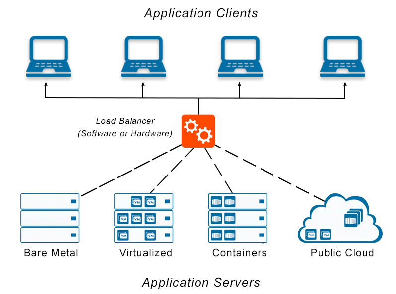

# Fundamentals of Software Architecture

書名：軟體架構原理 - 工程方法 ( Fundamentals of Software Architecture - An Engineering Approach )

出版社：O'Reilly

## 失效中的公理 ( Invalidating Axioms )

**公理，一個被視為己被確定、接受或不證自明為真的敘述或主張**

數學以公理為基礎延伸很多應用數學與論點，因為公理的真實性無可爭辯；在軟體設計中，架構就如同公理，一切的設計與應用皆源自於此。

然而，軟體與數學不同之處，是軟體的生態系是動態平衡的狀態，即使在某個時間點市場的技術要求是平衡的，但這其中仍有無數的微小動態在悄然改變著基礎，猶如單機應用程式因網路誕生而出現網際網路應用程式，亦如虛擬機容器化誕生而出現如分散式雲端服務 ( Kubernetes )； 架構師其中一個職責，就是質疑前個世代的公理，並非公理錯誤，只是現今的生態系中是否仍然適用，猶如 MVC ( Model-View-Controller ) 是互動應用程式的常見架構，但應用於現在的生態系其定義與解釋有了新解，亦延伸出如 MVP ( Model-View-Presenter )。

**在軟體架構中沒有正確，只有最適**

如同[The Software Architect Elevator](./the-software-architect-elevator.md)提到，質疑每一件事是架構師的職責，不論是否有必要改變，都有必要去懷疑現況、去思考假設、去探索新知、去重新定義公理，然後取捨公理，最後加以實踐決策後的公理；透過工程的邏輯思維與實務經驗，歷史中堆疊出無數的架構，便是本書所要介紹的主要內容。

**程式撰寫時深信公理，程式除錯時懷疑公理**

看文本書並不會讓人成為架構師，但這書期望的是提供足夠的觀念，給予閱讀者一個思考的切入點，而身為架構師則需如前述一般，在實務時要信任已知的公理，在思考時要懷疑已知的公理。

## 軟體架構

### 架構定義 ( Architecture Definition )

軟體架構難以定義，不論是 [Pattern-Oriented Software Architecture](../software-engineering/architecture_pattern.md) 或 [The Software Architect Elevator](./the-software-architect-elevator.md) 都有著各自的定義，其原因基於 **『Architecture is a concept.』** 來看可以理解為每個人對於觀念的解釋與看法各自不同，這也能對應 **『架構的定義幾乎與職業的架構師一樣多』** 的解釋；但不論是何種解釋，其中不乏相似且具有統一性的觀點，因此，本書提出了對軟體架構的定義：

+ 系統結構，系統元件間關係的說明或圖例
+ 架構決策，系統元件間的關係運作法則與限制
+ 架構特性，系統在此架構下可支援的特性 ( The Software Architect Elevator 一書中的非功能性需求 )
+ 設計原理，系統在此架構下依循的設計理論，亦是當決策衝突時的指導方針

舉例來說，規劃一個負載平衝系統，則其架構定義如下：

+ 負載平衝系統結構：from [Load Balancer Definition - Avinetworks](https://avinetworks.com/glossary/load-balancer/)

+ 結構決策：
    - 負載平衝會基於現有 Application Servers 運作狀態配置 Application Client 的請求
+ 架構特性：
    - 可擴展性，基於此架構可以依據系統需要增減對應設備來擴充處理量
+ 設計原理：
    - [分層式架構 ( Layered Architecture )](https://cs.uwaterloo.ca/~m2nagapp/courses/CS446/1195/Arch_Design_Activity/Layered.pdf)

軟體架構的定義是一種描述或說明架構概念與思維的資料呈現方式，而其中的決策、特性、原理更是架構規劃時會有爭議與更動的部分，這也符合書中對軟體架構的設計法則存在的一致性解釋的說法：

+ 軟體架構的一切皆是取捨
就如同前述構成軟體架構的部分有四個，而其四個互相關連但也可說互相獨立構成，這也使得規劃時會基於軟體需求與執行環境的衝突，亦或是原理與特性矛盾；倘若出現此狀況，就必需對其結構、決策、特性、原理的細節中做出取捨，以平衡此架構的設計結果。

+ 為什麼遠比如何來得重要
對架構來說如何做到往往不是問題，為什麼要這樣做反而是問題；也可以說架構設計之初就反映了架構師對系統、語言的技術底蘊深厚，但更多是基於前述架構師要懂得懷疑，而同樣的觀念也回到軟體架構的描述上，對此其設計往往會是基於一個疑惑、問題而來，從而基於某個原則、達到某種特性，從而規劃出結構並制定決策。

### 架構思維 ( Architectural Thinking )

架構師是架構定義的實踐者，與純粹的開發人員並不相同，架構師對於實踐職責的看法與觀點，便是架構思維，而本書對這思維提出了四個面向：

+ 引導團隊基於架構概念實踐需求

理解架構與設計的分界，並藉由領導與教導逐步將架構實踐於設計層面；架構是一種概念，而概念得以實踐的成品可視為框架 ( Framework )，而框架則是需求設計的核心；然而，架構師即便基於概念完成框架，若無法讓開發人員理解，並實際遵循框架完成需求，則架構所規範的一切便無從得以實踐。

+ 綜觀需求的技術知識廣度

開發人員的職業生涯其目的在於提升程式語言、產品知識領域的深度，然而這樣的思維容易犯的錯誤便是對於任何問題皆用這些知識實踐，缺乏廣度思維導致技術債的積累；而架構師重視技術廣度，需要的是縱觀產品的不同面向，藉由開發、維運、銷售等不同角度看待產品，在從中做出決策，從而避免技術債積累或提升架構特性。

+ 概念實踐沒有對錯僅有符合現況最適的妥協

開發人員往往會問『怎樣設計才是對』，追求正確避免犯錯是人之常情，然而對架構師來說，所有解決方案皆有優劣，提升一方特性便會負擔一方缺陷，在認知此面向的前提上，衡量黃金交叉的風險可能後做出決策與取捨，找尋最適合產品現況需要的設計。

+ 業務需求決定需要實踐多少概念

在資本市場上，產品的販售取決於客戶的需求，而客戶的需求創造了名為『業務驅動需求』的開發流程，當業務創造了需求，便產生了設計此需求的過程，而架構奠基了設計的根本，倘若需求導致設計無法遵循根基，則表示架構構成的基石不夠涵蓋業務所需的面向，這時就須從業務面切入，來評估與衡量是否有新的架構概念需實踐來奠定更多的基石。

### [模組化](https://www.gushiciku.cn/pl/amRi/zh-tw) ( Modularity )

 **軟體架構中常討論模組化的好，卻嫌少提及如何達成**

 就如同整理書櫃很重要，但重要的書放哪邊，每個人都有自己的主張；模組化的方法與解釋，就如同整理書籍一般，架構師都有自己的看法和定義，而本書是如此定義：

 **一組標準化零件或獨立單元，可以用來建構更複雜的結構。**

 不同的程式語言對於模組機制也有不同，例如 Java 的套件、.NET 的命名空間，但不論基於定義或機制，模組化對架構來說有幾個主要目的：

 + 提升複用性
 + 提升軟體可讀性
 + 解決名稱衝突
 + 梳理編譯、封裝的結構
 + 管理相依關係

 若從軟體工程的詞語來解釋，本書對模組化的測量專注在三個概念與檢測算法：

 + [內聚性 ( Cohesion )](https://zh.m.wikipedia.org/zh-tw/%E5%85%A7%E8%81%9A%E6%80%A7_(%E8%A8%88%E7%AE%97%E6%A9%9F%E7%A7%91%E5%AD%B8))

內聚是指模組內元件的關係緊密度，在這模組內的元件，其功能運作正常會依靠模組內其他元件提供的功能來完成；對於內聚的檢測，除了七種變形的描述外，可以參考[內聚欠缺 ( LCOM )](https://mileschou.me/blog/review-cohesive-using-lcom/) 的算法來計算。

 + [耦合性 ( Coupling )](https://zh.m.wikipedia.org/zh-tw/%E8%80%A6%E5%90%88%E6%80%A7_(%E8%A8%88%E7%AE%97%E6%A9%9F%E7%A7%91%E5%AD%B8))

耦合或稱相依 ( Dependency )，耦合與內聚是相反的概念，耦合是指模組與模組間互相依賴的緊密度；對於耦合的檢測，本書採用 [Clean Architecture 的 The Stable Dependencies Principle](https://www.jyt0532.com/2020/03/27/coupling/) 的計算方法，藉由抽象性與不穩定性二維來評估類別的平衡與是否過度依賴導致維護難度增高。

 + [共生性 ( Connascence )](https://en.wikipedia.org/wiki/Connascence)

共生是指當一元件的變更時需另一個元件才能保持整體正確性，則兩元件即為共生，其中共生可分為靜態 ( 編譯期 )、動態 ( 執行期 ) 兩種；單就靜態共生，亦即程式碼間的共生，則概念解釋與耦合相似，但相比耦合重視的結構關係，共生重視的事件的關係，如動態共生解釋中提到並行 ( Concurrency ) 產生的關係性。

### 架構特性 ( Architecture Characteristics )

**架構師的職責是什麼？**

這是架構師最常被詢問且困惑的問題，然而從本書對架構定義、架構思維、模組化的描述來看，架構師的職責便是定義並實踐架構特性。

**開發者專注的是產品的服務功能，架構師專注的是產品的架構特性**

一個產品從專案管理員建立企劃，交由軟體分析師規劃需求，在讓開發團隊領取需求任務來逐一實踐；而架構師其職責是需要配合專案管理員，從其企劃中定義、發現，從而規劃出軟體必須完成的所有事情，因此，亦可說產品企劃著重功能完程度、架構規劃著重軟體完整度。

軟體完整度包括軟體產品的服務功能與架構特性，而架構師負責的便是從不同觀點來發現產品需要的架構特性，從而規劃與設計，在不同的架構師書籍中也稱其為**非功能性需求**、**品質屬性**，個人觀點則是**需求外的需求**；而在本書中，對於架構特性的規劃得滿足三個準則：

+ 指定與領域無關的設計考量
設計服務功能時，架構師基於特性規範需求實踐、運用的方式，例如基於效率考量而避免需求實踐的方式。

+ 影響設計的某些結構面向
設計服務功能時，架構師基於特性考量從新定義了需求的細節、模組化規範，這一部分往往是因為開發團隊著眼於自身熟悉的技術來觀察需求導致忽略影響層面，例如基於安全性考量規劃使用加密法，而非設計特殊資料結構。

+ 對應用程式的成功值為關鍵或重要
應用程式需要支援的架構特性無需多，因為特性增加會導致軟體的複雜度提升，因此，應著重對於產品軟體完整度的關鍵特性，且越少越恰當。

#### 運維的架構特性

軟體產品在實際運用時，需要考量的特性，此類特性會讓用戶直接感受到系統的狀況，因此開發人員也會注意此類特性的設計需要。

+ 可用性 ( Availability )
系統可持續使用的時間

+ 效能 ( Performance )
系統在壓力測試下，其各項分析、容量變化、回應時間的數值與穩定度

+ 連續性 ( Continuity )
災難復原能力，不會因系統異常、重啟導致執行狀態改變

+ 可恢復性 ( Recoverability )
業務連續性需求，例如災難發生時，系統能多快回復運作；與連續性描述不同，此特性是基於連續性正常下，仍需多少時間達成

+ 可靠性 ( Reliability )
系統是否安全可靠，是否關鍵且異常發生會影響人命、導致企業利益損失

+ 強健性 ( Robustness )
執行階段，一切導致系統異常的外因錯誤處理能力，例如網路異常、電力中斷、硬體錯誤等

+ 擴展性 ( Scalability )
當使用與請求增加時，系統可依靠擴展維持運作效能的能力

#### 程式碼結構的架構特性

軟體的本質便是程式碼，倘若程式碼的架構特性無法維繫，亦可看成技術債堆疊過多，導致軟體不可修改、維護，甚至必須重頭開始，而下列的特性則是基於程式碼的撰寫、編譯、執行各面向考量而成。

+ 可配置性 ( Configurability )
終端用戶修改軟體配置的能力與難易度

+ 延展性 ( Extensibility )
增添新功能的難易度

+ 可安裝性 ( Installability )
系統安裝至目標平台的難易度，常見為 Windows、Linux 兩大主要作業系統與 x86、arm 兩大 CPU 架構的主要平台

+ 復用性 ( Reusability )
產品復用共通元件的能力

+ 本地化 ( Localization )
基於用戶安裝環境、使用需要的語言支援程度

+ 維護性 ( Maintainability )
系統維護與更新的難易度

+ 可攜性 ( Portability )
系統在多個平台運作的程度，在單機應用程式上，此特性與可安裝性同義，但在網際網路運用時，則分為前端程式在不同瀏覽器上的可執行程度，後端在不同服務器上的可執行程度

+ 可支援性 ( Supportability )
系統需要的技術支援度，或系統偵錯時需要何種服務與依賴何種工具

+ 可升級性 ( Upgradeability )
軟體產品是否具有版本更替的能力

#### 跨領域運用的架構特性

基於開發 ( Dev )、運維 ( Ops ) 外，跨不同領域考量的架構特性，這些特性也可能被歸類 ( 重複 ) 在開發、運維特性中，但基於當代、當時的解釋仍會有所不同。

+ 可及性 ( Accessibility )
可觸及的所有用戶，例如色盲、聽損等失能用戶

+ 可歸檔 ( Archivability )
資料在保存一段時間後，是否有將資訊備份與歸檔或刪除的能力

+ 認證 ( Authentication )
安全性需求，確保用戶是其宣稱的本人

+ 授權 ( Authorization )
安全性需求，確保用戶只能存取應用的特定功能

+ 合法 ( Legal )
系統運作是否符合該國法律規範，例如個人資料保護法、公司法等

+ 隱私 ( Privacy )
內部員工可竊取產品內部資料的能力與限制度

+ 安全 ( Security )
基於隱私性的延伸考量，擴及整個開發體系的隱私程度

+ 可支援性 ( Supportability )
系統需要的技術支援度，或系統偵錯時需要何種服務與依賴何種工具

+ 易用性 / 可行性 ( Usability / Achievability )
用戶需要甚麼層次的訓練，才可利用產品為解決方案來達成目標

#### 國際標準組織 ( ISO ) 規範的架構特性

ISO 規範可以參考[軟體架構原則 ( Software Architecture in Practice)](https://www.oreilly.com/library/view/software-architecture-in/9780132942799/)中的品質屬性 ( Quality Attributes ) 說明

+ 效能 ( Performance )
    測量已知情況下，系統對資源的使用量與效能。
    - 時間行為 (  Time behavior )
    回應、處理時間，或產出率的測量值
    - 資源利用率 ( Resource utilization )
    使用資源的數量與種類，例如記憶體、硬碟容量等
    - 容量 ( Capacity )
    可以超過最大公認資源使用限制的程度

+ 相容性 ( Compatibility )
    一個產品、系統、或元件與其他產品、系統、或元件相容程度
    - 共存 ( Coexistence )
    在與其他產品分享共有環境與資源下，仍能有效率執行的能力
    - 互通 ( Interoperability )
    兩個或更多系統間交換與利用資訊的程度

+ 易用性 ( Usability )
    用戶對於使用系統達到目的的程度。
    - 適當性 ( Appropriateness )
    用戶能否識別軟體適合其需求
    - 易學性 ( Learnability )
    用戶學習軟體的難易度
    - 使用者錯誤保護 ( User error protection )
    軟體避免用戶犯錯的保護程度
    - 可及性 ( Accessibility )
    軟體可觸及的用戶類型

+ 可靠性 ( Reliability )
    系統在特定情況下，可持續運行時間的程度。
    - 成熟度 ( Maturity )
    軟體在正常運作時能否滿足可靠度需求
    - 可用性 ( Availability )
    軟體可正常運作
    - 容錯 ( Fault tolerance )
    即使有硬體或軟體故障發生，軟體仍能正常運作
    - 可恢復性 ( Recoverability )
    軟體從異常導致失效中恢復的狀況、時間

+ 安全性 ( Security )
    軟體保護資訊與資料的程度，可使不同用戶擁有適合自身的授權層級來存取資料。
    - 機密性 ( Confidentiality )
    資料只能給經過授權的人存取
    - 完整性 ( Integrity )
    軟體能避免未經授權存取
    - 不可否認性 ( Nonrepudiation )
    任何用戶操作、系統事件產生皆可證實其發生
    - 可追責性 ( Accountability )
    能追溯用戶行動
    - 真實性 ( Authenticity )
    可證明用戶為登記資訊的本人

+ 維護性 ( Maintainability )
    開發人員能依據環境、需求，針對軟體的效果與效率改善、修正的程度。
    - 模組化 ( Modularity )
    軟體元件的內聚與耦合程度
    - 復用性 ( Reusability )
    開發人員能復用以完成資產的程度
    - 可分析性 ( Analyzability )
    開發人員蒐集軟體相關指標的難易度
    - 可修改性 ( Modifiability )
    開發人員改善、修正，在不增加瑕疵或降低現有品質的難易度
    - 可測試性 ( Testability )
    開發與測試人員對軟體測試的難易度

+ 可攜性 ( Portability )
    軟體將產品從一個環境轉移到另一個環境的能力與程度。
    - 適應性 ( Adaptability )
    軟體是否能有效的適應不同的軟體、硬體環境
    - 可安裝性 ( Installability )
    軟體能否在特定環境安裝與移除
    - 可取代性 ( Replaceability )
    開發人員是否能輕易以其他軟體取代某項功能

## 架構風格

### Layered

### Pipeline

### Microkernel

### Microservice

### Event-Driven
