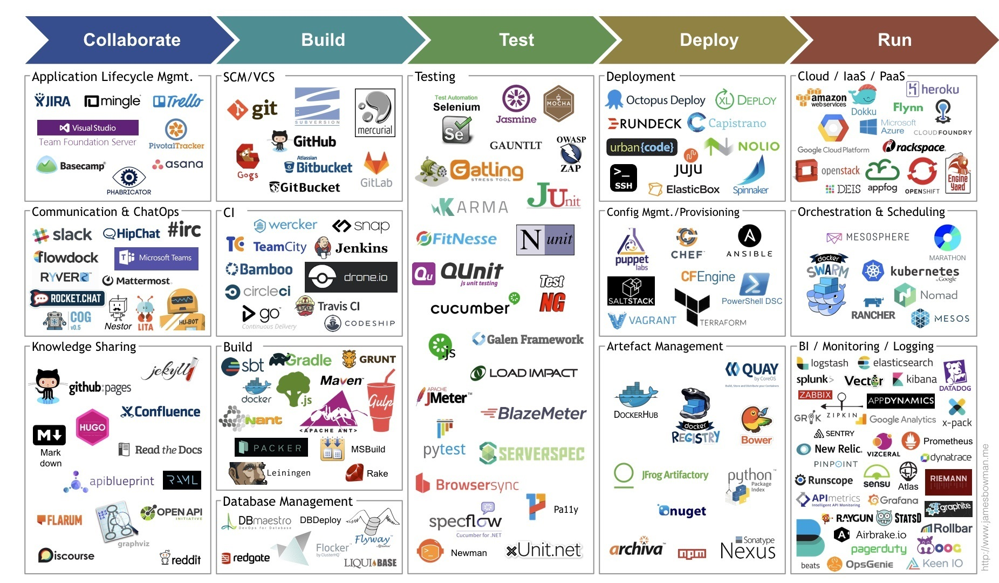

# DevOps 設計概念

<center>
    
</center>

[DevOps](https://zh.wikipedia.org/zh-tw/DevOps) 是自 2009 年起才逐漸受到重視的一套軟體架構概念，不同於過往軟體各自為政，在 DevOps 的架構觀念下，軟體間是互相服務與支援，就如同分散式架構與微服務架構中各服務雖然獨立但彼此仍可透過服務架構保持聯繫，只是軟體架構與開發仍維繫在單一軟體服務上，DevOps 更像是讓各類軟體工具串聯起來，構建出一個更加龐大的生態體系 ( ecosystem )。

因此，DevOps 就如上圖所呈現的，開發 ( Dev ) 環節與維運 ( Ops ) 環節接續運作也環環相扣，從而構建的循環運作，若抽象其運作方式，便可知悉兩個主要原則：

+ Pipeline，CI / CD 的工作流程
+ Schedule，CI / CD 的執行時間

若言簡意賅的說，DevOps 便是指在什麼時間處裡什麼 CI / CD 流程的管理與運作架構，而依據所需的 CI / CD 規模與特性不同，實務流程中會有諸多細節變化，但其中仍然不會脫離 Pipe & Filter 的流程運作概念與 Layer 的分層管理概念。

## 運作流程

基於 Pipe & Filter 架構的軟體設計概念的探討可源自於 [dataflow-architecture](https://github.com/eastmoon/dataflow-architecture) 的架構設計與整理，但更原始的來說，程式本質就是一種 top-down 執行的流程，在規模化後延伸出副程式 ( Subroutine )、函數 ( Function ) 的設計，而將這設計方式規模抽象便是 Pipe & Filter 的設計概念。

因此，若對 Pipe & Filter 的運用規模預想僅限單一語言，則解釋便是程式與函數，若預想是配合不同程式命令的銜接，則解釋便是腳本與命令；在架構是概念的原則下，對於不同預想也會用不同手段實踐，若將主題回到 DevOps 的運作流程，則會基於預想的生態體系 ( ecosystem ) 而有差異，就如同文獻中所提的諸多軟體服務工具。

在此針對實務過的 DevOps 軟體討論其流程運作的預想。

#### [Jenkins](https://github.com/eastmoon/infra-jenkins)

Jenkins 是最常被提到的開源軟體，以 Java 語言撰寫，並擁有大量的第三方工具可整合不同的軟體服務，在運用上除撰寫 Pipeline 會用上 Groovy 語法外，可以透過介面與工具設定完成大部分的基礎工作。

但實務運用上，考量 IaC ( Infrastructure as Code ) 的原則，在規模複雜的編譯、封裝、部屬程序下，使用介面設定反而成為阻礙，因此，目前規模化的實務上會透過 Jenkins 為介面與環境呼叫以 Shell 撰寫成的指令操作集合腳本。

可即使不使用 Jenkins 的第三方工具，仍會運用 Jenkins，主要是因為其設計是以工作 ( Job ) 為單位，流程為輔助 ( Schedule )，並可獨立運行的工作與不用依存特定軟體的執行方式，執行條件、執行時間則依據需要設定即可；其次，考量開發、整合、測試環境一致讓 DevOps 腳本歸屬於專案，僅提供操作指令，這樣抽象設計讓 DevOps 的工作集中在運用系統命令與操作專案指令，進一步則是讓所有 DevOps 需要的測試、檢核環節都專案化，以此達到優化 Jenkisn 設定與提升組合方式。

Jenkins 的優點是本質僅提供一個操作介面與執行環境，缺點則是過度利用介面與第三方容易則阻礙規模化，需要規模化則需讓 Dev 回歸撰寫腳本與各語言對應的操作、讓 Ops 運用介面構成所需的流程。

#### [Gitlab](https://github.com/eastmoon/infra-gitlab)

Gitlab CI 與 Travis CI 皆是以原始碼管理軟體的變更為工作執行條件，其流程執行的時間點為專案 ( Repository ) 的 分支 ( Branch ) 內容變更的狀況發生；相比 Jenkins 對工作自由規劃與定義，Gitlab CI 的工作則是對應專案本身，使專案異動發生則 CI / CD 機制應相應執行。

在實務運用上，Gitlab CI 依存專案為觸發條件，在團隊能遵循 [Git flow](https://gitbook.tw/chapters/gitflow/why-need-git-flow) 開發，且專案間具獨立性足夠，則使用 Gitlab CI 的 CI / CD 其效率能確實提升；同樣的版本變更才執行，在 Jenkins 設計除設定工作跟隨專案，就會需要建立額外的版本鎖來避免重複的工作執行。

Gitlab CI 的優點是版本管理與 DevOps 軟體整合，且能做到變更及執行的快速產出，缺點則是工作基於專案，使得跨專案間的整合、封裝、測試需不斷累積專案來管理工作。

#### [AirFlow](https://github.com/eastmoon/infra-airflow)

AirFlow 是用於資料處理的工作流程管理系統 ( Workflow Management System, WfMS )，其流程與時間的規劃方式與 Jenkins 相似，以 DAG 為建置流程的單位，觸法執行方式亦可自行規劃，現行框架仍由 Apache 支援多個對資料倉儲系統的服務系統。

在實務運用上，AirFlow 可以視為限制使用第三方工具與介面建構的 Jenkins，但運用於 DevOps 相比 Jenkins 並不恰當，主要是 AirFlow 一切可基於 Python 語言構成，無論是 WebUI 的呈現、資訊、執行腳本，雖然，藉由 Shell 撰寫成的指令操作 DevOps 整合腳本可以另其執行與 Jenkins 相同，但考量運用時對 WebUI 調整的需求，AirFlow 的 Workflow as Code ( WaC ) 反而需要運用具有開發人員的知識與技術觀念。

AirFlow 的優點是基於 WaC 原則，並提供開發的資料運算流程能有個操控界面與執行狀況說明，其中動態產生工作流更是一個有趣的設計，缺點亦是這般運用 Python 導致運用人員需對提高開發思維。

## 分層管理

基於 Layer 架構的設計常用於系統架構中，最常用於解釋 [3-Tier 架構](https://www.finereport.com/en/product-functions/3-tier-architecture.html) 的關係，而用在 DevOps 軟體設計概念的探討出自 [calculate-service-architecture](https://github.com/eastmoon/calculate-service-architecture) 的架構設計，以此整理各階段的通訊原則與其中單元運作專案類型的歸納與設計方向。

以 Layer 來規劃與設計 DevOps 考量以下幾點：

+ DevOps 各階段關係固定且具有單向通訊原則
+ DevOps 各階段猶如層級且設計原則上不可跨越層級互通，依據實務狀況會有忽略階段
+ DevOps 各階段會依據目標使用不同的軟體與語言實作

在藉由 Layer 規劃後，可參考下圖所示，整理自身在各階段的軟體運用關係。


> From [What *actually* is DevOps?](https://rafaelhart.com/2018/02/what-actually-is-devops/)

由於不同軟體間對於資料的管理與軟體控制方式各有不同，因此優先基於 Layer 的規劃與設計 DevOps 階層間的系統指令與管理程式，例如下述專案結構：

```
devops repository
  └ Build
  └ Test
  └ Deploy
```

而 DevOps 的系統指令與管理，會配合如以下的專案來掌控各軟體的啟動、設定，並彙整出結果至指定目錄，便於 DevOps 管理指令搬移與彙整。

+ [Gitlab](https://github.com/eastmoon/infra-gitlab)
+ [Jenkins](https://github.com/eastmoon/infra-jenkins)
+ [Http File Server](https://github.com/eastmoon/infra-hfs)
+ [elsticsearch & kibana](https://github.com/eastmoon/infra-elk)

透過上述步驟，將規模化的 DevOps 系統細緻到各專案有統一的管理指令與專案結構，進而確保其後增添進 DevOps 工作單元與流程依據規則持續運行。

## 結論

DevOps 規劃與設計的需求來源於專案、產品、公司規模，諸如新創團隊此等規模，即使沒有 DevOps 來整合開發流程與自動化也不會影響團隊工作效率，但若開發團隊人數、專案與產品數量增加，利用 DevOps 來彙整資訊、開發環境統一、自動化產品封裝與部屬、檢驗產品可靠與穩定性等，這類需求就會逐漸浮現。

在多數情況下，團隊成長時部分開發會基於需要建立自身所需的 DevOps，但常會基於自身慣用語言、軟體來設計，導致 DevOps 規模增加時碰到難以維護或無法分工的問題。

而若將見聞彙整，則可歸類為以下狀況：

+ 運作流程適用當時，不適用擴大後的規模
+ 分層管理僅用運用軟體本身，無抽象設計與統一軟體的專案結構

這些設計狀況多數原因是考量便利完成與尚且適用，且 DevOps 的演進往往以年度推進，因此，問題往往是推積到產出與收益無法平衡時才會重視。

## 文獻

+ Tools
    - [30 Best DevOps Tools to Learn and Master In 2023: Git, Docker, Jenkins and More](https://www.simplilearn.com/tutorials/devops-tutorial/devops-tools)
    - [Top 14 CI CD Tools for your DevOps project](https://www.browserstack.com/guide/top-ci-cd-tools)
    - [20 Best Workflow Management Software In 2023](https://www.softwaretestinghelp.com/workflow-management-software/)
    - [Top 7 Best ELT Data Pipeline Tools](https://blog.panoply.io/best-data-pipeline-tools)
