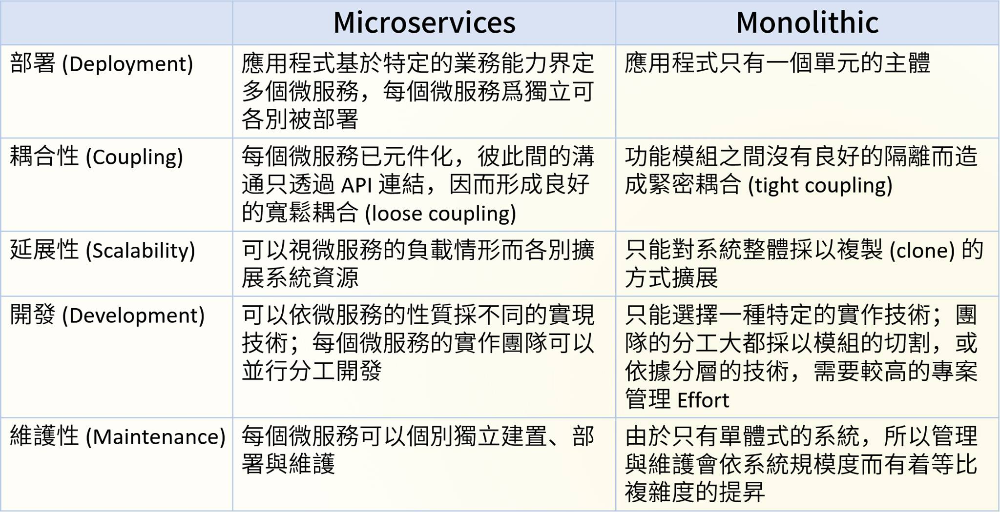
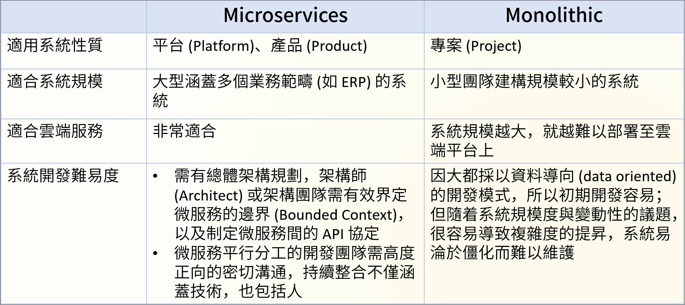

## Microservice architecture

**微服務 ( Microservices ) 是一種軟體架構，它是以專注於單一責任與功能的小型功能區塊 ( Small Building Blocks ) 為基礎，利用模組化的方式組合出複雜的大型應用程式，各功能區塊使用與語言無關 ( Language-Independent/Language agnostic ) 的 API 集相互通訊。**
> form [Microservices wiki](https://zh.wikipedia.org/wiki/%E5%BE%AE%E6%9C%8D%E5%8B%99)

從軟體專案的發展與歷程來解讀，應用程式初期設計在人力、時程、需求有限時，會採用 Monolithic 方向規劃，而這也是多數應用程式專案範本、教學容易說明與解釋的方式；然而，這樣的設計會因為應用程式的開發人力、期程、需求擴大，使 Monolithic 走向巨型應用程式，導致開發成果出現過度相依、重複設計、技術基礎不同等問題，進而使得開發時程不斷消耗在除錯、修補間。

而從 Monolithic 轉換為 Microservice 架構的作法，可謂基於軟體工程的分而治之 ( divide and conquer ) 法則而來，就已傳統單機應用程式 ( PC Application ) 來說，採用動態連結函式庫 ( Dynamic-link library、DLL )、插件架構 ( [Plug-in architectire](https://medium.com/omarelgabrys-blog/plug-in-architecture-dec207291800) 同樣符合概念；而網頁應用程式 ( Web Application ) 的 Monolithic 除了原始需求外，還必須考量三層式架構 ( 3-tier architecture ) 、負載平衡架構 ( load balance architecture)、持續整合與交付 ( Continuous Integration/Continuous Delivery ) 等基於規劃與效率的架構，因此即便是簡單的 Monolithic 也遠比在單機應用程式複雜，也基於這點考量才孕育出 Microservice 架構。

### Monolithic & Microservice

> from [什麼是微型服務？ - AWS](https://aws.amazon.com/tw/microservices/)

| 特性 | Microservice | Monolithic |
| :-: | :----: | :----: |
| 單位設計	| 此應用程式包含鬆耦合的服務。每項服務都支援單一商業工作。	| 整個應用程式都是以單一單位設計、開發和建置。
| 功能重複使用	| 微服務定義向任何從屬端顯示其功能的 API。從屬端甚至可以是其他應用程式。	| 跨應用程式重複使用功能的機會受到限制。
| 應用程式內的通訊	| 若要彼此通訊，應用程式的微服務會使用要求-回應通訊模型。典型的實行使用以 HTTP 協定為基礎的 REST API 呼叫。	| 內部程序 (函數呼叫) 有助於應用程式元件之間的通訊。不需要限制內部程序呼叫的數目。
| 技術靈活性	| 每個微服務都可以使用最適合微服務所設計解決問題的程式設計語言和架構來開發。	| 通常會以單一程式設計語言撰寫整個應用程式。
| 資料管理	| 分散式：每個微服務都可以使用自己的資料庫。	| 集中：整個應用程式使用一或多個資料庫。
| 佈署	| 每個微服務都會獨立部署，而不會影響應用程式中的其他微服務。	| 不過，任何變更需要重新建置並重新啟動整個應用程式。
| 維護性	| 微服務是簡單、集中且獨立的服務。因此，應用程式更容易維護。	| 當應用程式範圍增加時，維護代碼會變得更複雜。
| 復原能力	| 應用程式功能會分配至多個服務。如果微服務失敗，其他微服務所提供的功能仍可使用。	| 任何元件的失敗都會影響整個應用程式的使用狀態。
| 擴展性	| 每個微服務都可以獨立於其他服務之外進行擴展。	| 整個應用程式必須調整規模，即使業務需求僅適用於應用程式的特定部分。
> Reference from [瞭解微服務架構 - Oracle Cloud](https://docs.oracle.com/zh-tw/solutions/learn-architect-microservice/index.html#GUID-BDCEFE30-C883-45D5-B2E6-325C241388A5) and [Microservices, Martin Fowler and James Lewis, 2014](https://martinfowler.com/articles/microservices.html)

> Reference from [軟體設計鮮思維社團](https://www.facebook.com/groups/softthinking/permalink/1657246364480927)

### Service architecture

#### Defined

+ Service could be replace by other.
+ Service organization by functional or business logic.
+ Service could be difference language and database.
+ Service relationship is not hierarchy.
+ Work with Continuous Delivery.

Microservice Architecture is not [Service-Oriented Architecture](https://zh.wikipedia.org/wiki/%E9%9D%A2%E5%90%91%E6%9C%8D%E5%8A%A1%E7%9A%84%E4%BD%93%E7%B3%BB%E7%BB%93%E6%9E%84), Microservice is an application, SOA is a service which integration multiple application.

#### Design

+ Interface
    - HTTP
        + 採用 HTTP/REST 的應答式接口，發送端可依據其流程決定如何應用該接口，缺點是反應速度受限 HTTP 機制本身。
    - AMQP
        + 事件驅動式的 Message Queue，依據公開的事件發送資訊，可做到雙向主動通知，缺點是需設置中央管理的 Message Queue。
    - TCP
        + 點對點連線，對已知目標服務申請連線，以此達到高速傳遞訊息，缺點是需明確知道對象服務並建立連線，且連線無法中斷下會導致網狀連線設計的風險。
+ Storage
    - Database
        + 採用關聯式資料庫管理系統 ( RDBMS )，建立長期儲存資料機制
        + 使用 SQL 語法與相關存取工具
        + 可設計遷移 ( Migration) 機制，對資料庫進行版本控制
        + 可設計備份、還原機制，提高資料安全性
    - Cache
        + 採用 NoSQL 資料庫，建立高速存取數據急
        + 依據資料庫類型設計存取機制與工具
        + 資料庫結構依據服務所需獨立，且資料無需考慮安全性
        + 可設計資訊定時移除，並且不考慮重啟時資料存在必要性
+ Communication
    - Event Store
        + 事件管理中心，協助轉送事件給目標服務的中心服務
        + 定期檢查服務是否存在，若不存在則無需協助轉送
        + 可記錄服務啟用狀態、事件轉送狀態，有利於追蹤系統運作與維護
        + 存在中心服務設計缺點，若過量的訊息轉送，會導致服務運作受限於中心服務主機效能
        + 適用於無 HTTP 接口的常駐服務
    - Message Queue
        + 服務開放數個訊息柱列，提供外部服務提出服務處理內容
        + 柱列特性可協助服務緩衝訊息，平衡處理與接收速度，避免處理訊息遺失
        + 柱列可為各服務獨立功能或為訊息柱列中心服務主機
        + 適用於無 HTTP 接口的常駐服務
    - Directory
        + 資訊目錄，提供服務註冊、檢查的目錄服務
        + 目錄服務會管理一份服務資訊目錄於 Cache
        + 服務間通訊使用資訊目錄構成通訊格式，並以 HTTP/REST
        + 適用於有 HTTP 接口的應答服務
+ Encapsulation
    - Docker
        + 使用容器虛擬機封裝執行環境、服務軟體
        + 容器映像檔可版本控制

#### 參考

+ [Microservices wiki](https://zh.wikipedia.org/wiki/%E5%BE%AE%E6%9C%8D%E5%8B%99)
    - [瞭解微服務架構 - Oracle Cloud](https://docs.oracle.com/zh-tw/solutions/learn-architect-microservice/index.html#GUID-BDCEFE30-C883-45D5-B2E6-325C241388A5)
    - [什麼是微型服務？ - AWS](https://aws.amazon.com/tw/microservices/)
    - [走入軟體架構演進史　見證微服務發展今昔](https://www.netadmin.com.tw/netadmin/zh-tw/technology/1716C14FB29749B68D8E74C93ACA6263)
    - [嫻熟微服務架構運作　方能建構可靠安全系統](https://www.netadmin.com.tw/netadmin/zh-tw/technology/0FCEF017F1734985804D3777C8478605)
    - [Overload Control for Scaling WeChat Microservices](https://zhuanlan.zhihu.com/p/84415217)
+ [Microservices Authentication and Authorization Solutions](https://medium.com/tech-tajawal/e0e5e74b248a)
